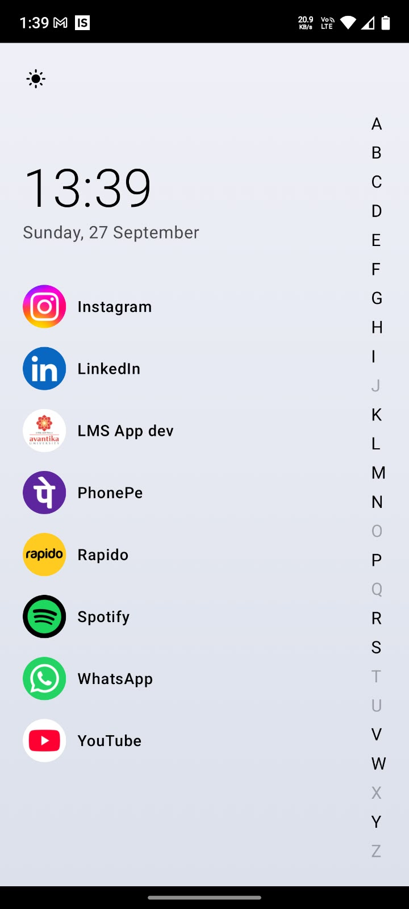
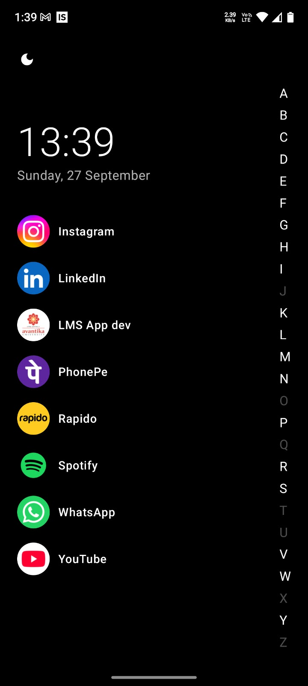
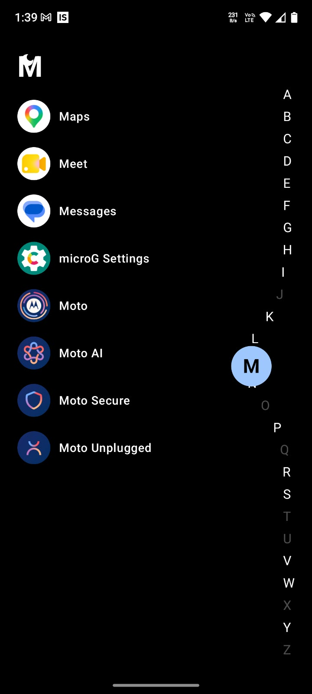
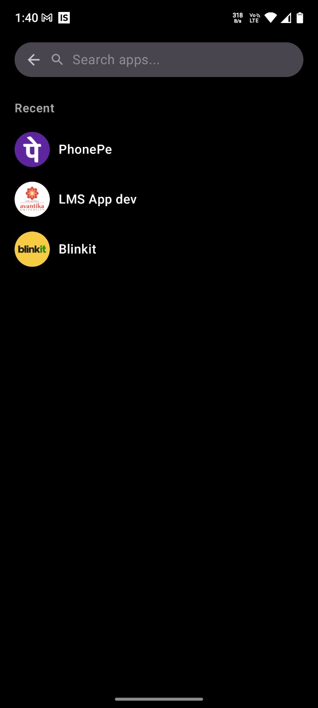

# Alphabet Launcher

An Android home-screen replacement with a vertical A–Z bar on the right edge.
Dragging a finger along the bar bends nearby letters toward it in a smooth,
iOS-contacts-style curve, and the screen switches to show every installed
app starting with the letter under the finger.

Built for the NovaFocus Private Limited Android Developer Assignment.

**Screen recording:** [https://canva.link/h40e5wcw73h1wn2]
- 1 min video showing features and animation etc
- canva public link 

---

## Screenshots

| Resting state (light)                            | Resting state (dark)                           | Dragging / curve + bubble              | Search bar                            |
|--------------------------------------------------|------------------------------------------------|----------------------------------------|---------------------------------------|
|  |  |  |  |

---

## Core requirements — status

| # | Requirement | Status |
|---|---|---|
| 1 | Live clock/date + favourites list | ✅ |
| 2 | Vertical A–Z bar, right edge, star at top | ✅ |
| 3 | Real installed-app list via `PackageManager`, Android 11+ visibility handled | ✅ |
| 4 | Curve animation follows finger, 60fps, no stutter | ✅ |
| 5 | Letter bubble next to finger | ✅ |
| 6 | Filtered list while dragging, sorted A–Z, case-insensitive | ✅ |
| 7 | Empty-letter state | ✅ |
| 8 | Spring-back to straight line on release | ✅ |
| 9 | Tap to launch | ✅ |
| 10 | App list loaded/cached once, no PackageManager calls on the touch path | ✅ |

## Bonus features implemented

- ✅ Set as default launcher (`CATEGORY_HOME`)
- ✅ Haptic feedback on letter change
- ✅ Spring physics on release (`Spring.DampingRatioMediumBouncy` / `StiffnessLow`)
- ✅ Swipe-up search with live filtering, swipe-down to close
- ✅ Long-press to favourite/unfavourite, persisted via `SharedPreferences`
- ✅ Live app-list refresh on install/uninstall (`BroadcastReceiver`)
- ✅ Dim letters with no matching apps
- ✅ Unit tests on the curve math and touch-to-letter logic
- ✅ Light/dark theme, follows system + manual override toggle

Not implemented: drag-to-reorder favourites; recent-apps list in search does
not persist across app restarts (resets to empty on relaunch).

---

## Architecture

```
app/src/main/java/com/novafocus/alphabetlauncher/
├── MainActivity.kt                 — entry point; owns theme state and the recents list
├── data/
│   ├── AppInfo.kt                  — immutable app snapshot (label, package, icon, first letter)
│   ├── InstalledAppsRepository.kt  — queries PackageManager once, caches result, live-update stream
│   └── FavouritesStore.kt          — SharedPreferences wrapper for persisted favourites
└── ui/
    ├── AlphabetBar.kt              — curve animation + touch tracking (the core file)
    ├── HomeScreen.kt               — home, letter-filtered list, search screen, app rows
    ├── LauncherViewModel.kt        — StateFlow<LauncherUiState>, filtering + favourites logic
    └── theme/Theme.kt              — light/dark MaterialTheme color schemes

app/src/test/java/.../ui/AlphabetBarTest.kt — unit tests for the curve math
```

Animation/touch logic (`AlphabetBar.kt`) has no knowledge of `PackageManager`
or the app list — it only ever emits a selected `Char` and a raw touch Y.
Data loading (`InstalledAppsRepository`) has no knowledge of Compose or
animation. This separation is deliberate, per the assignment's "Code
quality" criterion.

---

## How the curve animation works

While a finger is down, its Y position is tracked directly with a custom
`pointerInput` / `awaitPointerEvent()` gesture loop — not `detectDragGestures`,
because that reports movement *deltas*, and what the curve needs each frame
is the finger's **absolute** position, since that's what determines which
letter is closest. Reading the raw pointer event each frame also means
there's no animation lag while actively dragging — the bar bends exactly as
fast as the finger moves.

Each letter's horizontal pull toward the finger is computed with a Gaussian
falloff:

```kotlin
pullForDistance(rowsAway, maxPullPx) = maxPullPx * exp(-(rowsAway / 2.4)²)
```

The touched letter gets the full pull; letters further away fall off along
a bell curve rather than a straight line, which is what gives the bend its
rounded, iOS-contacts-style bulge instead of a sharp V. `2.4` controls how
many letter-rows away the pull has roughly halved — tuned by eye against the
reference video.

A single `Animatable`-backed value (`curveAmount`) snaps to `1f` the instant
a finger goes down (no lag on press) and springs back to `0f` on release via
`animateFloatAsState` with a bouncy spring spec, producing the slight
overshoot-and-settle seen in the reference video.

Both `pullForDistance()` and the touch-to-letter mapping (`letterForTouchY()`)
are plain, side-effect-free functions with no Compose/Android dependency —
kept that way specifically so they're unit-testable on the JVM without an
emulator (see `AlphabetBarTest.kt`).

---

## Libraries used

| Library | Version | Why |
|---|---|---|
| `androidx.core:core-ktx` | 1.13.1 | Kotlin extensions for core Android APIs; also provides `ContextCompat.registerReceiver` with the export-flag overload required on Android 13+ |
| `androidx.activity:activity-compose` | 1.9.2 | Compose integration for `ComponentActivity` (`setContent`) |
| `androidx.lifecycle:lifecycle-runtime-ktx` | 2.8.6 | Lifecycle-aware coroutine scopes |
| `androidx.lifecycle:lifecycle-viewmodel-compose` | 2.8.6 | `viewModels()` delegate + ViewModel/Compose wiring |
| `androidx.lifecycle:lifecycle-runtime-compose` | 2.8.6 | `collectAsStateWithLifecycle()` |
| `org.jetbrains.kotlinx:kotlinx-coroutines-android` | 1.8.1 | `Flow`/`callbackFlow` for the install/uninstall live-update stream |
| `androidx.compose:compose-bom` | 2024.09.02 | Version alignment (BOM) for all Compose artifacts below |
| `androidx.compose.ui:ui`, `ui-graphics` | via BOM | Core Compose UI |
| `androidx.compose.material3:material3` | via BOM | Material 3 components, color schemes, typography |
| `androidx.compose.foundation:foundation` | via BOM | `pointerInput`, `Image`, layout primitives — used directly for the curve animation's gesture handling |
| `androidx.compose.material:material-icons-extended` | via BOM | Search/theme/back icons |
| `junit:junit` | 4.13.2 | Unit tests for the curve math and touch-to-letter logic |

**No third-party animation, gesture, or icon-pack libraries.** The curve
animation, spring physics, and touch tracking are all written by hand in
`AlphabetBar.kt`, per the assignment's requirement that the core animation
not be pulled from a library. `SharedPreferences` (built into the platform)
is used for favourites instead of a persistence library, since it's just a
small set of package name strings.

---

## Setup

```bash
git clone <https://github.com/mustafa2506q/Alphabet_Launcher.git>
```

Open in Android Studio (Koala or newer recommended) and let Gradle sync —
no manual configuration needed. Requires:

- JDK 17
- `minSdk 26`, `compileSdk`/`targetSdk 34`

Run on a physical device for the true feel of the curve animation and
haptics; an emulator works for functional testing but won't demonstrate
frame-rate smoothness meaningfully.

To set as your default launcher: after installing, press the home button
and choose "Alphabet Launcher" when Android prompts you to pick a launcher
(or set it manually in **Settings → Apps → Default apps → Home app**).

---

## AI tool disclosure

I used Claude (Anthropic) extensively while building this: debugging build
and manifest errors (pasting error output to understand what was wrong and
how to fix it — e.g. the Android 11+ package-visibility issue and an Android
13+ registerReceiver crash), iterating on UI details (sizing, theming,
gesture behaviour), writing the unit test file, and drafting this README.
The core curve animation — the Gaussian falloff function and the
touch-tracking gesture handler, which the assignment calls out as the piece
that should be written personally — I worked through with Claude's help but
made sure I understand fully, since that's the part I'll be asked to explain
and modify live in the interview.

---

## Limitations

Alphabets is overlapping the theme toggle button at the top left in App

---
